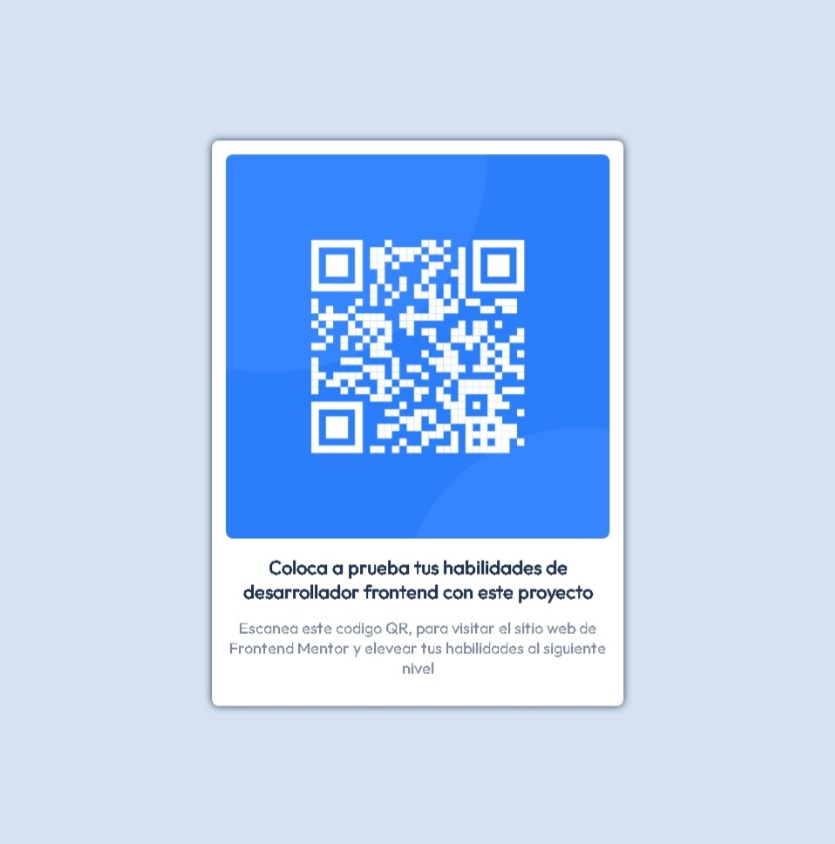

# Frontend Mentor - QR code component

## Bienvenido! 👋

Gracias por el incentivo al publicar este reto, y por tomarte la molestia de realizar la revision.

Este reto es cortecia de: [Frontend Mentor](https://www.frontendmentor.io).

## El trabajo realizado!

1. Este trabajo se realizo usando HTML5.
2. CSS Basico.
3. Flex-box Basico.
4. Google Fonts Api.

## El esquema de colores.

- White: hsl(0, 0%, 100%)
- Light gray: hsl(212, 45%, 89%)
- Grayish blue: hsl(220, 15%, 55%)
- Dark blue: hsl(218, 44%, 22%)

## La fuente utilizada.

- Family: [Outfit](https://fonts.google.com/specimen/Outfit)
- Weights: 400, 700

## Ancho minimo.

El ancho minimo para la visualizacion es de 375px

